# SiglusEngine过验证  
以爱因斯坦为例，这个版本是目前来说比较新的，同时也没有带壳，用来作为例子最为合适。  

## 一、区域判定  
直接运行程序，弹出错误框：  
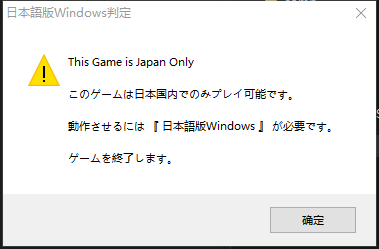  
那么首先来过区域验证。  
打开x32dbg，把主程序拖进去，然后下端MessageBoxW，跑起来，程序断下，开始分析这个函数。  
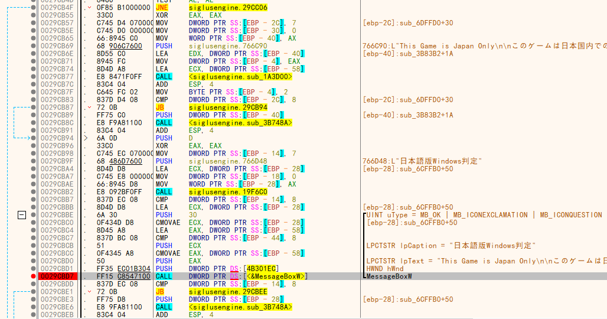  
让我们稍微回溯一下，可以看到上面有个jne的大跳，直接跳过当前的MessageBoxW，说明当验证成功时，他就会跳过。  
接下来要做的就很简单了，重新载入游戏，把jne改成jmp强制跳转，这样不管是否验证成功，他都会按照验证成功进行处理。  
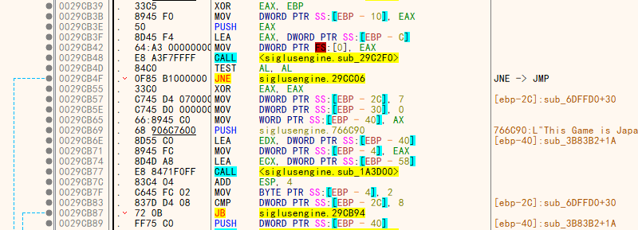  
注意，siglus不止一个判断区域的点，仔细往下跟踪跳转，发现他还在进行验证，每个验证函数后面都有一个大的跳转，一般来说一共三处，全部都需要修改。  
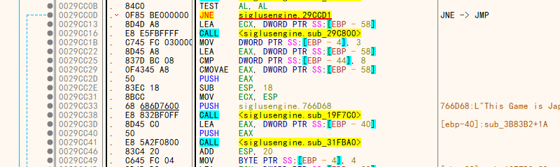  
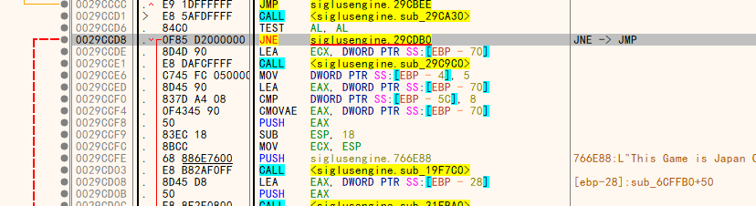  
这里有一个比较进阶的玩法。当全部跳转完成后，他会让该函数返回值变成1。  
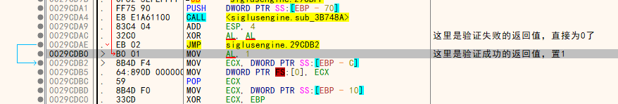  
试想，能不能让这个函数不进行验证，直接返回验证成功？  
我们回到这个函数开头，重新载入游戏，在这个函数的顶端直接修改，让他返回1：  
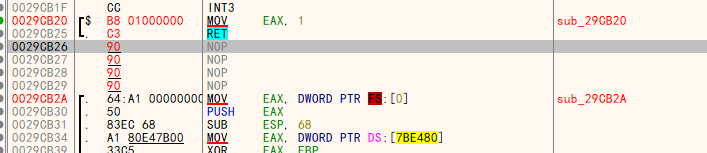  
然后跑起来，没有再提示区域错误，直接打开了游戏，说明我们破解成功。  
## 二、DVD验证  
接着，游戏弹出如下画面：  
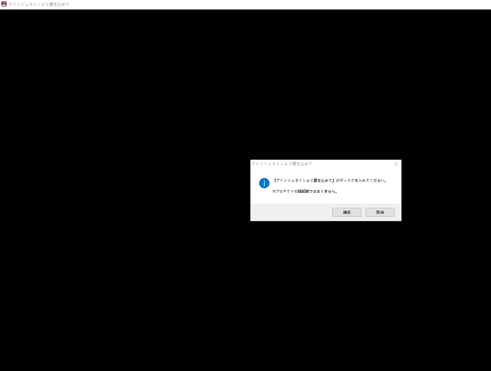  
说明游戏需要验证DVD。  
我们还是下断MessageBoxW，来到他断下的位置。  
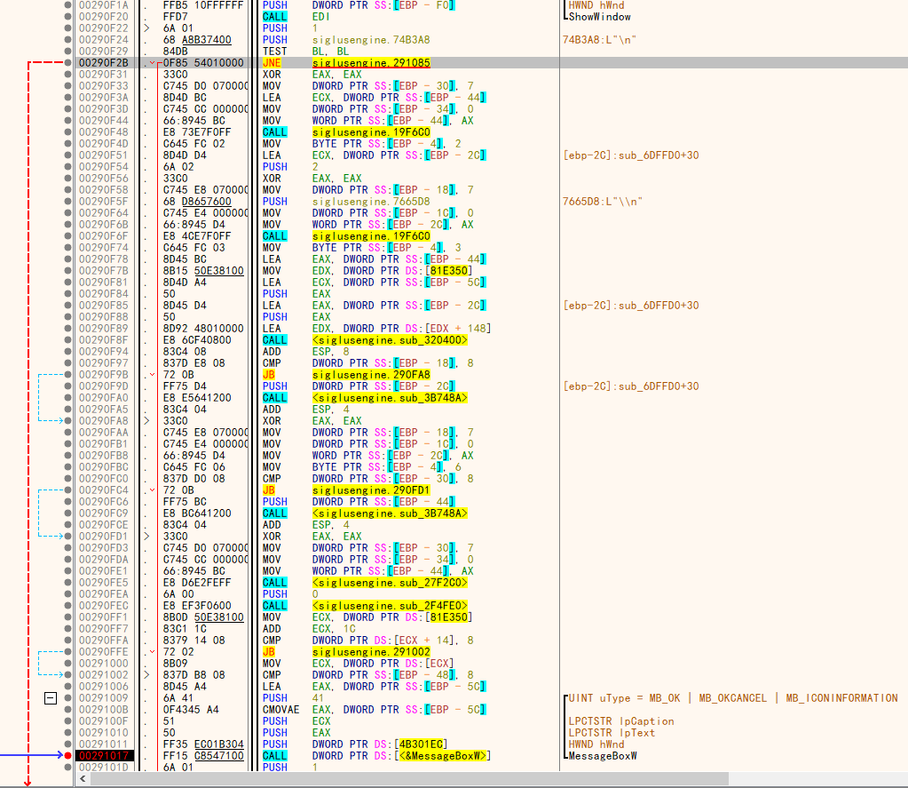  
接着向上回溯，发现有一个大跳jne跳过了错误代码部分。可以猜想，这个是认证成功后的跳转。那么我们来试一下。  
由于这里是个循环，我们不需要重新载入游戏，直接让他循环回开头即可。  
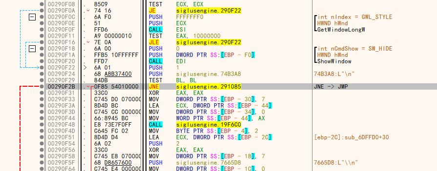  
来到这里，我们把jne改成jmp强制跳转，然后运行。  
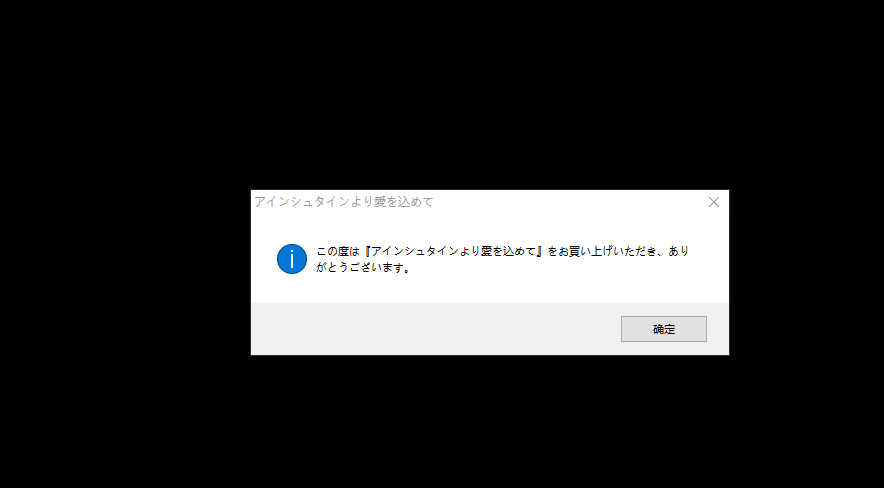  
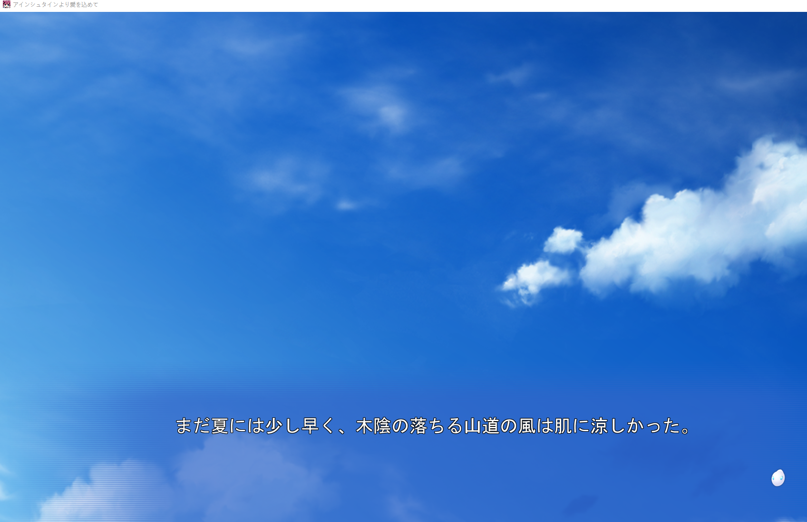  
游戏运行成功了。  
至此，siglus的运行验证已经破解完毕。  