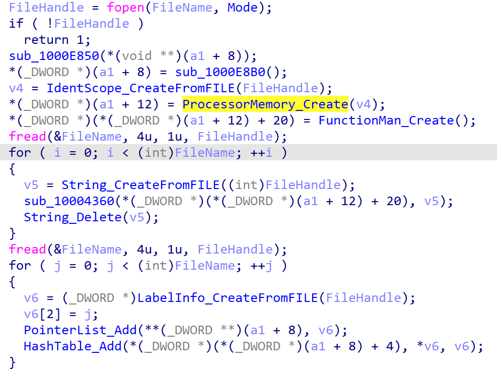
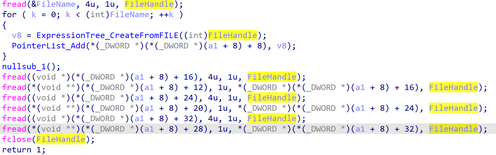
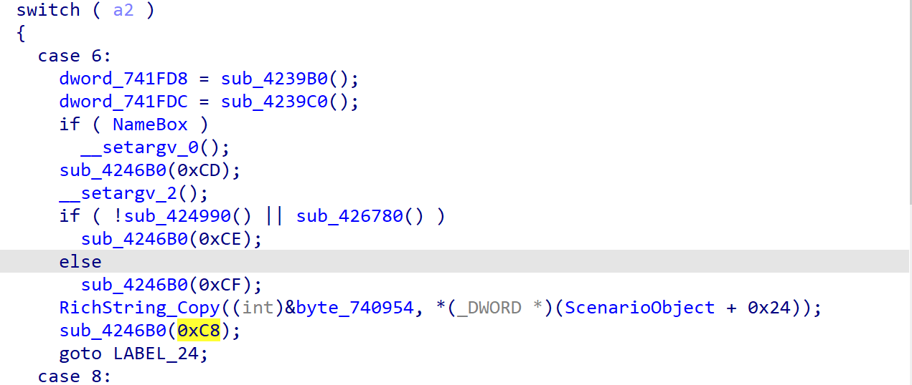
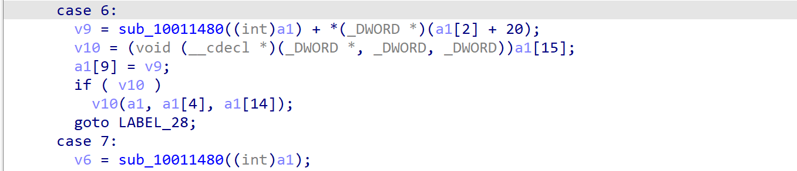
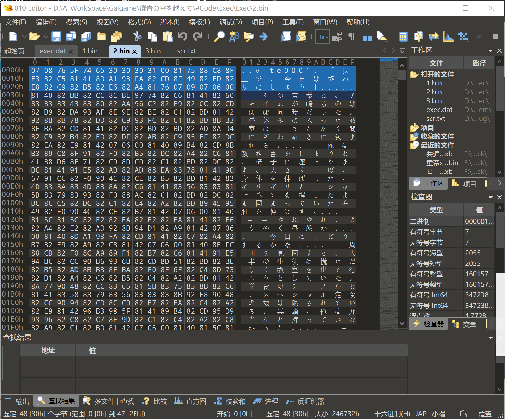
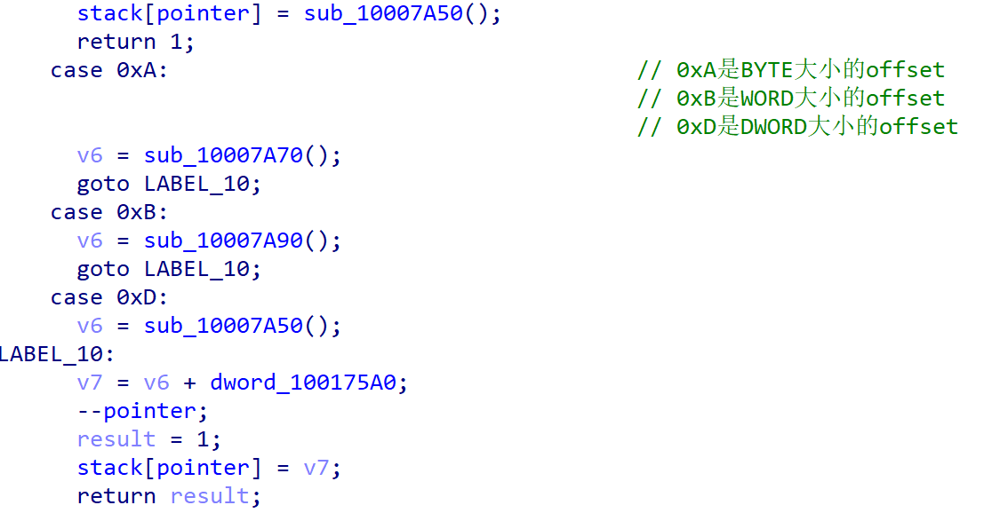
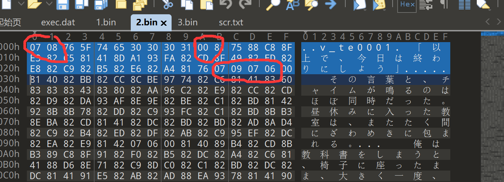
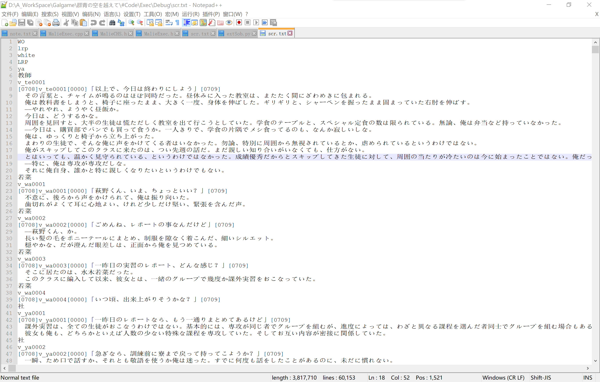

# malie脚本提取

近期不知道为什么，对light的老游戏特别情有独钟，于是分析了古早malie引擎。果然难度很大啊，花了一个星期。

下面就开始讲。

这不是入门教程，这个游戏也不适合入门。建议有需要提升自己的人可以看看

\----------------------------------------------------------------------------------------------------------

首先脚本会初始化。

脚本的初始化是从ScenarioProcessor_LoadExecImage开始。

这个函数在sc.dll里面，让我们来简单看看这个函数：





很明显，脚本被分成七块，其中前四块是组成list保存，后面三块就是code，text和label块（明显读取大小都不一样）。汉化我们只需要关注这三块就行。

这段代码可以简化一下再复盘一下。原因之一就是后面的很多函数都是递归调用，我们不方便自己转化实现。

code块记录了VM代码，text就是游戏的文本，label就是各种标签（包含人名、选项）。所以我们要提取文本需要解析VM代码，把人名和文本匹配起来。

祭出我们的x64dbg和CE，直接对文本下断点。他停在RichString_GetLengthByte，再往上追一层，到RichString_Copy。很明显，这是个复制字符串的函数。那我们就继续跟下去看。

函数很快返回到一个case里面：



很明显，这里是case6的body。也可以理解成，最后的一个OP应该是0x6

接着往外跟，来到ScenarioProcessor_Step，最后返回到0x6的body里面：



同样的，我们得到语音文本的第二个op：0x6

为了省力（其实就是懒……），我们可以半黑盒半开盒分析。

比如我们这找到一个VM段代码：

23 04 06 06 00 00 00 00 0A 0C 08 06 30 00 00 00

这段代码有两个很明显的点：以DWORD分割，全部单独看起来很明显，是op+offset的模式。

刚好我们打开text的第一句话，是一句语音。他的op是 23 04 06 06，满足上面的分析结果

这个时候我们就可以猜测0A 0C 08 06的op是属于啥。他后面跟了一个30 00 00 00。我们去text里面看看：



完美对应。

接下来是人名匹配：

人名匹配需要读VM代码link到label对应的offset。

这玩意儿不太好找，我们还是上一段VM代码：

04  23    04  06 02  12 00  0E 38 04 00 00  07 12 64  12 2A  14 10 0A 79     04
OP FST LEN OP unk movEIP OP |---unk----| op op unk op unk op op op offset size

大概对了下，细节别在意（

这一段代码就是对着程序不断下一字节的断点，来分析作用（我也是逆到这里才发现这VM是参数变长类型的）。

我们可以根据上面的代码，可以得到他的结构为：14 10 ??(type) ??(offset)。



这一段就是解析label段的文本。

到这里，文本解析算基本完成了，但离提取还有点距离：



我们可以看到，在文本中掺入了一小部分不能识别的代码，我们需要把这些替换一下，回封时再替换回来。关于这个，参考后面的代码。

来个效果图：



\----------------------------------------------------------------------------------------------------------

第一次用python写这种代码，遇到处理指针的问题真的很寄啊（草）

写的很渣，随便看看就好。

ps：状态机所有机器码我没处理全，懒得跟了。

```python
import os

def int_from_bytes(xbytes: bytes) -> int:
    return int.from_bytes(xbytes, 'little')

code = open("1.bin","rb")
code_buff = code.read()
code.close()

text = open("2.bin","rb")
text_buff= text.read()
text.close()

label = open("3.bin", "rb")
label_buff = label.read()
label.close()

fp = open("scr.txt","wb")

idx=0
for idx in range(len(code_buff)):
    if code_buff[idx] == 0x14 and code_buff[idx + 1] == 0x10:
        label_point = 0
        v0 = code_buff[idx + 2]
        if v0 == 0xA:
            label_point = int_from_bytes(code_buff[idx + 3:idx + 4])
        elif v0 == 0xB:
            label_point = int_from_bytes(code_buff[idx + 3:idx + 5])
        elif v0 == 0xD:
            label_point = int_from_bytes(code_buff[idx + 3:idx + 7])
        else:
            continue
        tmp = label_buff[label_point:].find(b"\x00")
        size = len(label_buff[label_point:label_point + tmp])
        Name = label_buff[label_point:label_point + size]
        fp.write(Name+b"\r\n")


    elif (code_buff[idx] == 0x04 and
        code_buff[idx+ 1] == 0x23 and
        code_buff[idx + 2] == 0x04 and
        code_buff[idx + 3] == 0x06 and
        code_buff[idx + 4] == 0x06) :
        Voiceidx = 0

        Voiceidx = int_from_bytes(code_buff[idx + 5:idx + 9])
        tmp = text_buff[Voiceidx:].find(b"\x07\x06\x00")
        size = len(text_buff[Voiceidx:Voiceidx+tmp])
        VoiceText = text_buff[Voiceidx:Voiceidx + size]
        c = 0
        pVoice = b''
        i=0
        while(c < len(VoiceText)):
            if VoiceText[c:c+1]== b"\x00":
                pVoice += b"[0000]"
                c+=1
            elif VoiceText[c:c+2] == b"\x07\x06":
                pVoice += b"[0706]"
                c+=2
            elif VoiceText[c:c+2]== b"\x07\x08":
                pVoice += b"[0708]"
                c+=2
            elif VoiceText[c:c+2] == b"\x07\x09":
                pVoice += b"[0709]"
                c+=2
            else:
                p = bytes(VoiceText[c:c+1])
                pVoice += p 
                c+=1

        fp.write(pVoice+b"\r\n")

    elif (code_buff[idx] == 0x0A and
          code_buff[idx + 1] == 0x0C and
          code_buff[idx + 2] == 0x08 and
          code_buff[idx + 3]== 0x06):
        Normalidx = int_from_bytes(code_buff[(idx + 4):(idx + 8)])

        tmp = text_buff[Normalidx:].find(b"\x07\x06\x00")
        size = len(text_buff[Normalidx:Normalidx+tmp])
        NormalText = text_buff[Normalidx:Normalidx + size]

        pNormal = b''
        c=0
        while(c < len(NormalText)):
            if NormalText[c:c+1]== b"\x00":
                pNormal += b"[0000]"
                c+=1
            elif NormalText[c:c+2] == b"\x07\x06":
                pNormal += b"[0706]"
                c+=2
            elif NormalText[c:c+2]== b"\x07\x08":
                pNormal += b"[0708]"
                c+=2
            elif NormalText[c:c+2] == b"\x07\x09":
                pNormal += b"[0709]"
                c+=2
            else:
                p = bytes(NormalText[c:c+1])
                pNormal += p 
                c+=1
        fp.write(pNormal+b"\r\n")

fp.close()

```

