# SystemNNN中文化简记——基于源码的动态分析

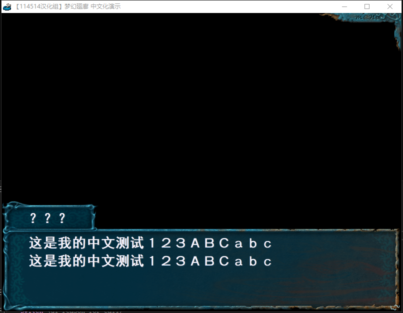

SystemNNN是一款开源引擎，所以逆向要方便些。

游戏：梦幻廻廊

## 一、文本&图片获取

源码在github上都搜得到。

### 1.脚本

#### 初始化脚本

脚本这块的处理在nnnLib/execscript里面，初始化函数是CExecScript::LoadScript，这里会加载脚本，解密脚本，赋值脚本全局变量，设置脚本EIP。

```C++
BOOL CExecScript::LoadScript(LPSTR filename)
{
    // 读入脚本
	m_pc = 0;
	m_stackPointer = 0;

	if (filename == NULL) return FALSE;

	if (_stricmp(m_filename,filename) == 0)
	{
		return TRUE;
	}

	memcpy(&m_filename[0],filename,strlen(filename)+1);

	INT64 fileSize = 0;
	FILE* file = CMyFile::Open(filename,"rb",&fileSize);
    
    ...
       // 解密脚本 
		__asm
		{
			push eax
			push ebx
			push ecx
			push edx
			push esi
			push edi
			mov ecx,sz
			mov esi,pt
//			mov ebx,0ffffffffh
			mov ebx,xorCode
			mov edx,addXorCode
			mov edi,0
LOOP1:
			mov eax,[esi]
			xor eax,ebx
			add eax,edi
			add ebx,edx
			add edi,addIncCode
			mov [esi],eax
			add esi,4
			dec ecx
			jnz LOOP1

			pop edi
			pop esi
			pop edx
			pop ecx
			pop ebx
			pop eax
		}
		m_dataExistFlag = TRUE;
		m_pc = 0;
		m_stackPointer = 0;

...
    // 设置脚本全局变量
    m_messageKosuu1 = m_data[4]; // 当前脚本普通文本数
	m_messagePointer1 = m_data[5]; // off
	m_messageKosuu2 = m_data[6]; // 当前脚本系统文本数
	m_messagePointer2 = m_data[7]; // off2

	m_storyKosuu = m_data[10];

	m_int32Pointer = m_data[18];	//@@@@@@@@@@@@@@@@@@@@@@@@@@@@@@@@@@@@@@@

	if (m_data[0] >= 32)
	{
		m_subCallPointer = m_data[20];
		m_selectPointer = m_data[21];
		m_commandCallPointer = m_data[22];
		m_scriptCallPointer = m_data[23];
	}
	else
	{
		m_subCallPointer = 0;
		m_selectPointer = 0;
		m_commandCallPointer = 0;
		m_scriptCallPointer = 0;
	}
}
```

这个函数过后，脚本的初始化就完成了。

#### 脚本解析

还是这个文件，往上翻，有个CExecScript::Exec的函数，传入的参数n就是EIP（如果为-1则指定0位EIP）。

```C++
int CExecScript::Exec(int n)
```

之后会有一些参数初始化（比如虚拟栈的调整啥的），姑且不看，直接进while循环，来到这里：

```C++
int identify = m_data[m_pc+1];
int code = m_data[m_pc+2];
```

spt脚本里面都是这样，会有一个识别符，确认当前引擎的状态，然后后面code来指定执行什么样的操作。包括参数也在后面。

如果要提取文本就很简单。CExecScript::Exec下面有两个函数：CExecScript::GetMessagePtr和CExecScript::GetStringPtr。分别是获取对话文本和系统文本的两个函数。如果你要解对话文本，那么就跟紧GetMessagePtr就可以了。对话文本的获取基本上都在这里：

```C++
		if (identify == IDENTIFY_SYSTEMCOMMAND)
		{
			if ((code == CODE_SYSTEMCOMMAND_PRINT) || (code == CODE_SYSTEMCOMMAND_LPRINT) || (code == CODE_SYSTEMCOMMAND_APPEND))
			{
				int cutin = 0;
				if (m_data[m_pc] >= 6)
				{
					cutin = m_data[m_pc+5];
				}


				m_callBack->ReceiveScriptCommand(code,m_data[m_pc+4],GetMessagePtr(m_data[m_pc+3]),cutin); // GetMessagePtr的参数是对话文本的ID，也就是第几个文本
				m_pc += m_data[m_pc];
				return CODE_SYSTEMCOMMAND_PRINT;
			}
```

而选项有点特殊，他并没有在Exec里面解析，而是在callback里面处理的。

```C++
if (code == CODE_SYSTEMCOMMAND_SELECT)
			{
				int mesKosuu = 0;
				int selKosuu = m_data[m_pc+3];

				int timeLimit = 0;
				int autoSelect = 0;
				int specialFlag = 0;
				int selectSerial = 0;

				if (m_data[m_pc] != (selKosuu+5))	//new version
				{
					mesKosuu = m_data[m_pc+m_data[m_pc]-1];
				}

				if (m_data[m_pc] > selKosuu+mesKosuu+5)	//new 2 version
				{
					timeLimit = m_data[m_pc+m_data[m_pc]-2];
					autoSelect = m_data[m_pc+m_data[m_pc]-3];
				}

				if (m_data[m_pc] > selKosuu+mesKosuu+6)	//new 2 version
				{
					specialFlag = m_data[m_pc+m_data[m_pc]-4];
				}

				if (m_data[m_pc] > selKosuu + mesKosuu + 7)	//new 3 version
				{
					selectSerial = m_data[m_pc + m_data[m_pc] - 5];
				}

				int tmp[256];
				tmp[0] = selKosuu;
				tmp[1] = mesKosuu;
				for (int i=0;i<selKosuu+mesKosuu;i++)
				{
					tmp[2+i] = m_data[m_pc+4+i]; // 把选项的ID设置进去
				}

				tmp[2+selKosuu+mesKosuu] = timeLimit;
				tmp[2+selKosuu+mesKosuu+1] = autoSelect;
				tmp[3+selKosuu+mesKosuu+1] = specialFlag;
				tmp[4 + selKosuu + mesKosuu + 1] = selectSerial;

				m_callBack->ReceiveScriptCommand(code,selKosuu+mesKosuu+2+2+1+1,tmp);
				m_pc += m_data[m_pc];
				return CODE_SYSTEMCOMMAND_SELECT;
			}
// 跟ReceiveScriptCommand：
void CGameCallBack::ReceiveScriptCommand(int cmd, int para1, LPVOID para2,int para3)
{
	if (cmd == CODE_SYSTEMCOMMAND_PRINT) SystemCommandPrint(para1,para2,para3);
	if (cmd == CODE_SYSTEMCOMMAND_LPRINT) SystemCommandLPrint(para1,para2,para3);
	if (cmd == CODE_SYSTEMCOMMAND_APPEND) SystemCommandAppend(para1,para2,para3);
	if (cmd == CODE_SYSTEMCOMMAND_DRAW) SystemCommandDraw(para1,para2);
	if (cmd == CODE_SYSTEMCOMMAND_SELECT) SystemCommandSelect(para1,para2); // 处理选项
...
}
// 跟SystemCommandSelect

void CGameCallBack::SystemCommandSelect(int para1,LPVOID para2)
{
	m_messageWindowPrintFlag = FALSE;

	CCommonSelectMessage* selObj = (CCommonSelectMessage*)m_general[SELECTMESSAGE_MODE];
	int kosuu = para1;
	
	selObj->SetBackLogMessage();

	int* strPtr = (int*)para2;
	int selKosuu = *strPtr;
	strPtr++;
	int mesKosuu = *strPtr;
	strPtr++;
	selObj->SetMessageKosuu(selKosuu,mesKosuu);

	m_lastSelectID = strPtr[selKosuu+mesKosuu];

	int specialFlag = *(strPtr+selKosuu+mesKosuu+2);
	selObj->SetSpecialFlag(specialFlag);

	CExecScript* lpScript = GetScript();

	for (int i=0;i<selKosuu+mesKosuu;i++)
	{
		LPSTR mes = lpScript->GetStringPtr(strPtr[i]); // 根据之前的选项ID来返回选项文本
		if (i<mesKosuu) mes++;
		selObj->SetMessageData(i,mes);
	}

	int timeLimit = *(strPtr+selKosuu+mesKosuu);
	int autoSelect = *(strPtr+selKosuu+mesKosuu+1);

	int selectSerial = *(strPtr + selKosuu + mesKosuu + 3);
	{
		char m[256];
		sprintf_s(m, 256, "\n\nselectSerial = %d\n", selectSerial);
		OutputDebugString(m);
	}
	m_selectSerialID = selectSerial;


	if (autoSelect == 0)
	{
		autoSelect = selKosuu+1;
	}
	selObj->SetTimeLimit(timeLimit,autoSelect);
	selObj->SetSpecialFlag(specialFlag);


	m_skipNextCommandFlag = FALSE;
	m_skipEffectCommandFlag = FALSE;
	m_skipToFilmEndFlag = FALSE;
	m_skipToFilmEndEnable = FALSE;
	SetReturnCode(SELECTMESSAGE_MODE);
}
```

注意这里，选项是走GetStringPtr来出现的，所以我们要获取文本，还得从GetStringPtr的规则来获取。

提取代码核心部分如下（忽略一些变量的变量名，一年前的代码了，我都不知道是怎么写的……）

```C++
	for (DWORD ecx = 0; ecx < DataSize; )
	{
		DWORD ebx = *(DWORD*)(FileBuff + ecx * 4);
		DWORD identify = *(DWORD*)(FileBuff + ecx * 4 + 4);
		DWORD code = *(DWORD*)(FileBuff + ecx * 4 + 8);
		DWORD count = *(DWORD*)(FileBuff + ecx * 4 + 12);
		DWORD pos = *(DWORD*)(FileBuff + ecx * 4 + 16);
		if (identify == IDENTIFY_SYSTEMCOMMAND)
		{
			if ((code == CODE_SYSTEMCOMMAND_PRINT) || (code == CODE_SYSTEMCOMMAND_LPRINT) ||
				(code == CODE_SYSTEMCOMMAND_APPEND))
			{
				char* str = (char*)(FileBuff + *(DWORD*)(FileBuff + (m_messagePointer1 + count) * 4) * 4);
				string ch = string(str);
				ch = FixString(ch);
				LOG << ch << endl;
				hit++;
			}
			if (code == CODE_SYSTEMCOMMAND_SELECT)
			{
				if (ebx != (count + 5))
				{
					count += *(DWORD*)(FileBuff + ecx * 4 + ebx * 4 - 4);
				}
				for (int i = 0; i < count; i++)
				{
					LOG << (FileBuff + *(DWORD*)(FileBuff + (m_messagePointer2 + pos + i) * 4) * 4) << endl;
				}
			}
		}

		ecx += ebx;
	}
```

### 2.图片

直接用garbro提取。

## 二、动态文本回封

既然我们手上有源码，那不如咱直接开挂（。

我们在IDA里面搜索CODE_SYSTEMCOMMAND_PRINT（0x22220001）的常量，可以搜到这些：


我们挨个挨个点，看到类似于下面的代码就F5。

```assembly
cmp     ecx, 66660006h
jnz     loc_4258A8
cmp     edi, 22220001h
jz      loc_425F33
cmp     edi, 22220002h
jz      loc_425F33
cmp     edi, 22220003h
jz      loc_425F33
```

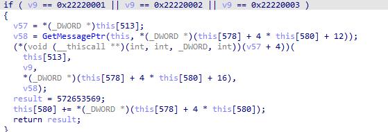


中间那个GetMessagePtr就是我们需要做手脚的函数。

既然已知传入的mesNum，那我们可以直接用mesNum来作为基准来替换文本：

```C++
CHAR TextBox[0x1000] = { 0 };
int(__fastcall* sub_425FA0)(DWORD* pThis, int null_ptr, int mesNum);
int __fastcall GetMessagePtr(DWORD* pThis, int null_ptr, int mesNum)
{
    if (mesNum == 0)
    {
        memset(TextBox, 0, 0x1000);
        lstrcpyA(TextBox, "？？？\r\n这是我的中文测试１２３ＡＢＣａｂｃ\r\n这是我的中文测试１２３ＡＢＣａｂｃ\r\n");
        return (int)&TextBox;
    }
    return sub_425FA0(pThis, null_ptr, mesNum);
}
```

返回只需要返回文本的位置就可以了。

同样，对于有选项的GetStringPtr，我们也可以用这种方法来定位。先找一个有GetStringPtr的op，然后在IDA里面找，然后获取到地址后直接hook。

需要注意的是，不管是GetMessagePtr还是GetStringPtr都是类成员，所以是thiscall，hook时需要有些调整。

## 三、动态图片回封

图片这里相对来说要麻烦一点。这里我大概总结了三种方法进行回封。

### 0. 定位图片读取函数

下端CreateFileA，老样子，让程序先跑一下，然后激活断点。当你看到他读取文件是dwq\\xxx.gpk时就停下，往外跟四层（其实就是跟出fopen），就来到了CPicture::OpenDWQFile。

### 1. 替换DWQ文件指针

我们分析一下OpenDWQFile。F5后来到这里：

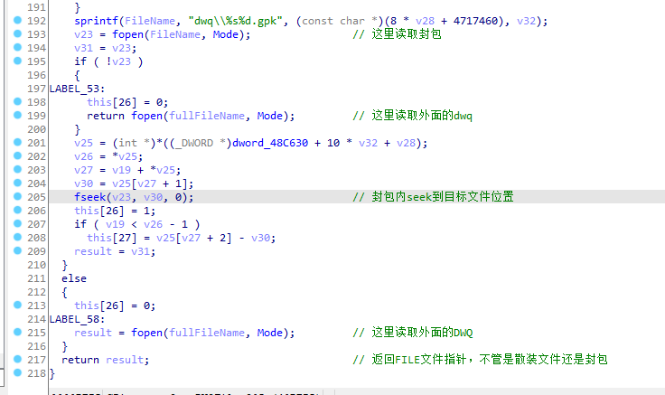

可以发现OpenDWQFile其实是打开dwq文件（或者存放dwq文件的封包，并seek到dwq文件位置），然后直接返回FILE*指针。

那我们的思路就可以是，在进入函数前，先外读存放好的dwq文件，如果有，则直接返回fopen后的FILE*指针，如果没有，就走原函数过程。

```c++
typedef FILE* (_cdecl* pFopen_t)(const char* FileName, const char* Mode);
auto pFopen = (pFopen_t)(BaseAddr + 0x3596);

FILE* fp = nullptr;
CHAR PicFileName[MAX_PATH] = { 0 };
FILE* (__fastcall* sub_40BB00)(DWORD* pThis, int null_ptr, LPSTR fullFileName, LPSTR filename);
FILE* __fastcall OpenDWQFile(DWORD* pThis, int null_ptr, LPSTR fullFileName, LPSTR filename)
{
    wsprintfA(PicFileName, "_pic\\%s.dwq\0", filename);
    //cout << PicFileName << endl;
    //fp = fopen(PicFileName, "rb"); error
    fp = pFopen(PicFileName, "rb");
    if (fp)
    {
        pThis[26*4] = 0;
        return fp;
    }
    return sub_40BB00(pThis, null_ptr, fullFileName, filename);
}
```

需要注意的是，虽然IDA里面显示fopen，但dll的CRT和游戏的CRT并不一样，因此如果要让返回的fp能被游戏所用，就要用游戏里用的fopen，而不是自己写fopen。

这种方法可以很方便的把dwq图片换掉，但前提是你要把图片封装成dwq，并且还是游戏支持的dwq类型，否则都会出错，或者显示怪异。

### 2. 根据不同的DWQ类型来替换dib数据。

大致用GARbro提取一下，我这里有BMP，PACKBMP+MASK，JPEG三种封装格式的dwq，这里只拿JPEG和PACKBMP+MASK来做例子。

#### 2.0 定位LoadDWQ

刚才那个OpenDWQFile，跟出便是LoadDWQ。

#### 2.1 JPEG

我们先打开源码，看下LoadDWQ处理jpeg格式的dwq大致的逻辑。

_注意：在一些老的SystemNNN游戏中并没有png的解析，只有BMP和JPEG的解析_

```C++
if (m_jpegFlag)
		{
			//bufferによみこむ
			fread(m_tmpBuffer,sizeof(char),m_dwqSize,file);	//?????????????size ok???
			m_restReadSize -= m_dwqSize;

			m_jpegDecoder->Decode(m_tmpBuffer,this);
//			m_pictureSizeX = 16;
//			m_pictureSizeY = 16;


			m_charaClipXStart = 0;
			m_charaClipXEnd= m_pictureSizeX;
			m_charaClipYStart = 0;
			m_charaClipYEnd= m_pictureSizeY;

		}
```

和IDA里面对比一下

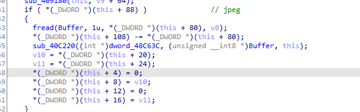

大致上对得上，然后我们去看下Decode函数

```C++
BOOL CJpegDecoder::Decode(char* pJpegData,CPicture* lpPicture)
{
	if (lpPicture == NULL) return FALSE;
	if (m_yuvBuffer == NULL) return FALSE;

	char* jpegPtr = pJpegData;

	m_markerSize = 0;
//static int tmflag = 0;

	BOOL myTrue = TRUE;

	while (myTrue)
	{
...
		case JPEG_SOS:
			BOOL b;

			b = DecodeMain(jpegPtr,lpPicture); // here


			EMMSRoutine();

			return b;
			break;

		default:	//unknown
			break;
		}

		jpegPtr += GetWORDData(jpegPtr);
	}


	return TRUE;
}

// 继续跟DecodeMain
BOOL CJpegDecoder::DecodeMain(char* pJpegData, CPicture* lpPicture)
{
	
//static int tmflag = 0;

	m_oldDCY = 0;
	m_oldDCU = 0;
	m_oldDCV = 0;

	short* yuvBuffer = m_yuvBuffer;
	float* yuvBufferFloat = (float*)m_yuvBuffer;

	int ns = GetBYTEData(pJpegData + 2);
	int csi[4];
	for (SSIZE_T i=0;i<ns;i++)
	{
		int k = GetBYTEData(pJpegData + 3+i*2) - 1;

		csi[k] = GetBYTEData(pJpegData + 3+i*2+1);
	}


	int loopX = (m_picSizeX + 7) / 8;
	int loopY = (m_picSizeY + 7) / 8;

	pJpegData += GetWORDData(pJpegData);
	int bitPlace = 0;

	int* dst = (int*)(lpPicture->GetBuffer()); // 获取dib buffer地址
#if defined _TINYAN3DLIB_
	dst += 128 / sizeof(int);
#endif

	RECT rc;
	lpPicture->GetPicSize(&rc);

	SSIZE_T lPitch = rc.right;

	int* dst0 = dst;

	SSIZE_T mcuKosuu = 0;
    
    ...
 
// 接着把Huffman解压后的yuv转换成rgb
if ((m_calcuFloatFlag == FALSE) && !bMustUseFloat)
			{
				for (SSIZE_T pp=0;pp<sampleBlock;pp++)
				{
					IDCTFastMMX(m_huffmanDecodedBuffer+64*pp,yuvBuffer+pp*64*3,&m_DQTTable[m_yuvDQTTableNumber[0*3+2]*64]);
				}

				IDCTFastMMX(m_huffmanDecodedBuffer+sampleBlock*64,yuvBuffer+64,&m_DQTTable[m_yuvDQTTableNumber[1*3+2]*64]);
				IDCTFastMMX(m_huffmanDecodedBuffer+sampleBlock*64+64,yuvBuffer+64*2,&m_DQTTable[m_yuvDQTTableNumber[2*3+2]*64]);


				//YUV 4:1:1
				if (sampleBlock>1)
				{
					UVFact4(yuvBuffer);
					//
				}


				//yuv->rgb

				//
				for (SSIZE_T ppp=0;ppp<sampleBlock;ppp++)
				{
					YUV2RGB(yuvBuffer+ppp*64*3,m_rgbBuffer+ppp*64);
				}
			}
			else
			{
				for (SSIZE_T pp=0;pp<sampleBlock;pp++)
				{
					IDCTFastFloat(m_huffmanDecodedBuffer+64*pp,yuvBufferFloat+pp*64*3,&m_DQTTable[m_yuvDQTTableNumber[0*3+2]*64]);
				}

				IDCTFastFloat(m_huffmanDecodedBuffer+sampleBlock*64,yuvBufferFloat+64,&m_DQTTable[m_yuvDQTTableNumber[1*3+2]*64]);
				IDCTFastFloat(m_huffmanDecodedBuffer+sampleBlock*64+64,yuvBufferFloat+64*2,&m_DQTTable[m_yuvDQTTableNumber[2*3+2]*64]);


				//YUV 4:1:1
				if (sampleBlock>1)
				{
					UVFact4Float(yuvBufferFloat);
					//
				}


				//yuv->rgb

				//
				for (SSIZE_T ppp=0;ppp<sampleBlock;ppp++)
				{
					YUV2RGBFloat(yuvBufferFloat+ppp*64*3,m_rgbBuffer+ppp*64);
				}

			}
    
    ...
        
int* rgbBuffer = m_rgbBuffer + (px+py*2)*64;
					int* rgbBuffer0 = rgbBuffer;

					int* dstdst = dst + px*8 + py*lPitch*8; // 定位
					int* dstdst0 = dstdst;
	
					for (SSIZE_T jj=0;jj<psizey;jj++)
					{
						rgbBuffer = rgbBuffer0;
						dstdst = dstdst0;

						for (SSIZE_T ii=0;ii<psizex;ii++)
						{
							*dstdst = *rgbBuffer;	//复制
							dstdst++;
							rgbBuffer++;
						}

						rgbBuffer0 += 8;
						dstdst0 += lPitch;
					}
```

我们可以清晰的看到，他把jpg的yuv数据转换成了rgb数据，并且在最后进行复制。

既然转换成rgb咱就有办法了。首先在最开始获取dib数据地址的地方下hook，复制一份地址。然后再函数结束时再下个hook复制dib数据。

```C++
DWORD dst_addr = 0;
void __stdcall CopyDib(BYTE* dst)
{
    if (dst_addr != 0)
    {
        FILE* fp = fopen(PicFileName, "rb");
        if (fp)
        {
            cout << PicFileName << endl;
            fseek(fp, 0, SEEK_END);
            DWORD size = ftell(fp);
            fseek(fp, 0, SEEK_SET);
            BYTE* buff = new BYTE[size];
            fread(buff, size, 1, fp);
            fclose(fp);

            int width, height, bit_depth;
            NakedMemory dib;
            if (!ReadPngToBmp(buff, size, &width, &height, &bit_depth, dib))
            {
                delete[] buff;
                return;
            }
            if (bit_depth == 24)
                dib = Dib24To32(width, height, dib);// 如果是24位图则上升到32位
            BMP_TO_DIB((PBYTE)dib.Get(), width, height, 32);

            cout << "start copy" << endl;
            memcpy(dst, dib.Get(), width * height * 4);
            dst_addr = 0;
            cout << "end" << endl;
        }
    }
}

// jpg
PVOID pGetDibAddr = (PVOID)(BaseAddr + 0xC4E9);
__declspec(naked)void GetDibAddr()
{
    _asm
    {
        mov dst_addr, eax; // 获取dib地址
        jmp pGetDibAddr;
    }
}

PVOID pDoCopy = (PVOID)(BaseAddr + 0xC3AA);
__declspec(naked)void DoCopy()
{
    _asm
    {
        pushad;
        pushfd;
        push dst_addr;
        call CopyDib; // copy
        popfd;
        popad;
        jmp pDoCopy
    }
}
```


不过值得注意的是，虽然解出来是24位，但是最后复制是按照32位进行复制的。

看以下内存布局：

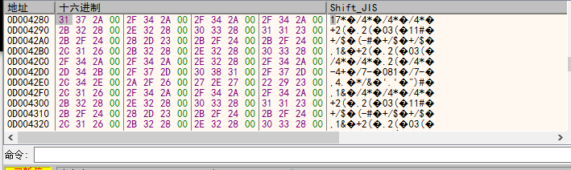

最后alpha那一位是0。所以最后替换的时候注意这个问题。

#### 2.2 PACKBMP+MASK

这个要相对麻烦一点，我们先在x32dbg里面跟，看他走哪个分支，然后去IDA里面对着看。

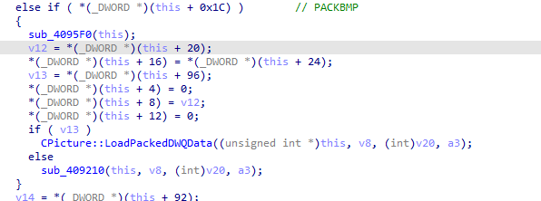

如果是packbmp，就会走LoadPackedDWQData分支。

我们用x32dbg跟进去：

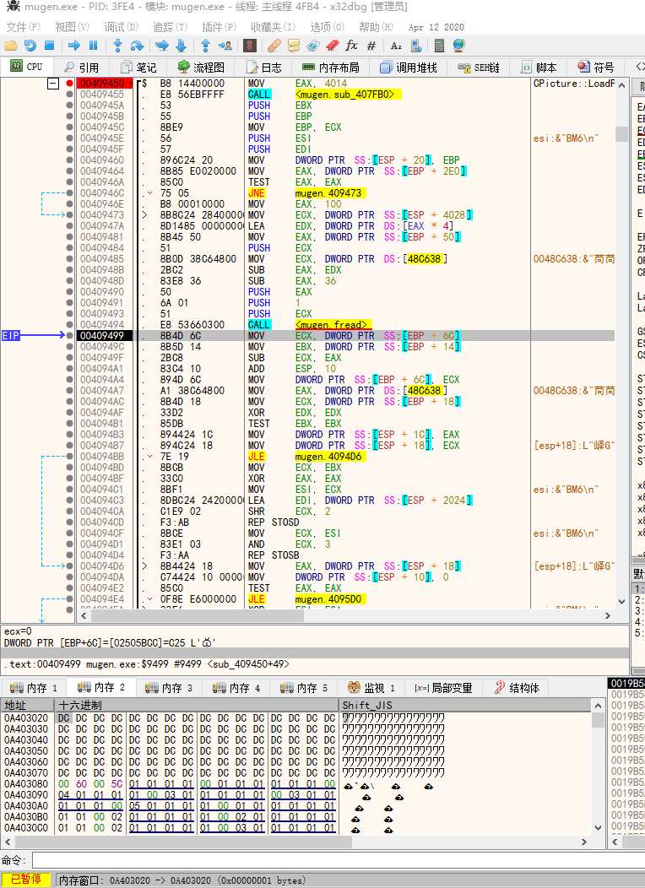

中间会有解压以及xor解密，一直跟踪来到这里

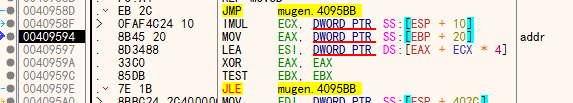

这里eax始终指向dib的地址，下一行就是dib的偏移地址。

现在思路有了，我们可以获取这个dib的地址，然后再函数执行完之前copy

由于[EBP+0x20]值没有变化，我们直接在fread之后获取这个值。

```C++
// PACKBMP
PVOID pGetDibAddr2 = (PVOID)(BaseAddr + 0x9499);
__declspec(naked)void GetDibAddr2()
{
    _asm
    {
        pushad;
        pushfd;
        MOV EAX, DWORD PTR SS : [EBP + 0x20] ;
        MOV dst_addr, eax;
        popfd;
        popad;
        jmp pGetDibAddr2
    }
}

PVOID pDoCopy2 = (PVOID)(BaseAddr + 0x95D0);
__declspec(naked)void DoCopy2()
{
    _asm
    {
        pushad;
        pushfd;
        push dst_addr;
        call CopyDib;
        popfd;
        popad;
        jmp pDoCopy2
    }
}
```

## 3. hook m_pic

其实在第二种方法里面，我们最后copy的都是m_pic。

JPEG里面有一个GetBuffer来获取dib ( m_pic ) 的值，这个函数的原形是这样的：

```C++
void* CPicture::GetBuffer(void)
{
	return m_pic;
}
```

而在PACKBMP中，对比IDA，我们也在源码中发现了m_pic的身影：

```C++
if (b256Flag)
		{
			char* ptr0 = (char*)m_pic;
			ptr0 += j * m_pictureSizeX;
			CopyMemory(ptr0,m_tmp,m_pictureSizeX);
		}
		else
		{
			int* ptr00 = (int*)m_pic;
			ptr00 += j * m_pictureSizeX;

			for (i=0;i<sizeX;i++)
			{
				int c = ((int)m_tmp[i]) & 0xff;
				*ptr00 = rgbTable[c];
				ptr00++;
			}
		}
```

不难发现，到最后我们copy的都是m_pic的值。有没有办法能只在一个地方copy，然后复制呢。

我们可以hook LoadDWQ整个函数来实现。先跑完函数，读完图片信息。然后在结构里找到m_pic的值，然后跟进去这个值，copy dib数据。

首先我们要获取m_pic的值在哪里。

我们回到LoadPackedDWQData里，F5一下，找到刚才所说的[EBP+0x20]的位置：

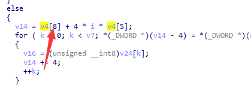

v4往前翻，就是this，并且就是CPicture的this，因此m_pic的值应该就是这里。

但是我们不能在这个函数里面下hook，我们要在LoadDWQ里面下，是他的母函数。所以我们可以在hook里面直接写明m_pic的地址：

```C++
int m_pic = pThis + 8 * 4;
```

（其实刚才看到的[EBP+0x20]中的0x20就是m_pic的地址）

获取到这里还不够，m_pic只记录了dib数据的地址，所以我们还要给他下一层指针：

```C++
BYTE* DibPtr = (BYTE*)*(int*)m_pic;
```

这样才是真正的dib数据位置。

```C++
BOOL(__fastcall* sub_409900)(int pThis, int null_ptr, LPSTR filename, BOOL b256Flag, int a4);
BOOL __fastcall LoadDWQ(int pThis, int null_ptr, LPSTR filename, BOOL b256Flag, int a4)
{
    wsprintfA(PicFileName, "_pic\\%s.png\0", filename);
    int m_pic = pThis + 8 * 4;
    BOOL ret = sub_409900(pThis, null_ptr, filename, b256Flag, a4);
    if (ret) 
    {
        BYTE* DibPtr = (BYTE*)*(int*)m_pic;
        CopyDib(DibPtr);
    }
    return ret;
}
```

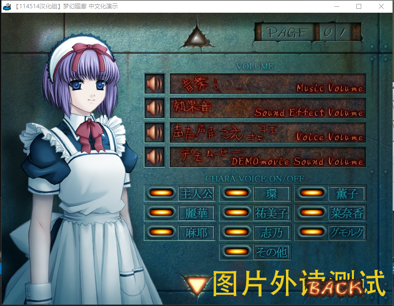

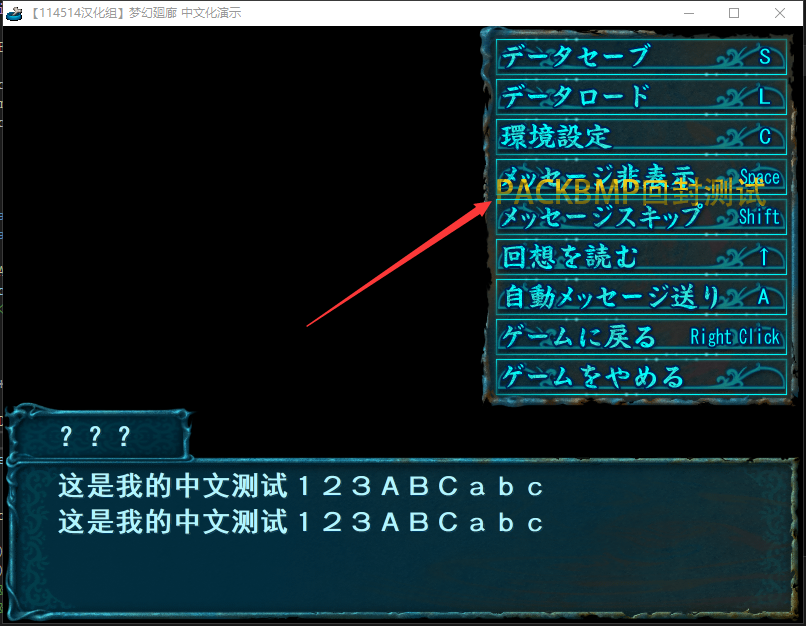

## 四、其他

### 1. 字体

Hook CreateFontA，把charset改成GB2312_CHARSET，把字体改成黑体（当然其他中文字体也行）。

### 2. 边界

SystemNNN的边界比较诡异……

搜索常量A0

```
.text:0041336A                 cmp     eax, 20h ; ' '
.text:0041336D                 jl      short loc_413374
.text:0041336F                 cmp     eax, 7Fh
.text:00413372                 jle     short loc_413382
.text:00413374
.text:00413374 loc_413374:                             ; CODE XREF: sub_412EF0+47D↑j
.text:00413374                 cmp     eax, 0A0h
.text:00413379                 jl      short loc_4133A9
.text:0041337B                 cmp     eax, 0DFh
.text:00413380                 jg      short loc_4133A9
```

把A0改成FE

```
.text:0041726E                 cmp     eax, 0EFh
.text:00417273                 jle     short loc_417277
.text:00417275                 xor     ecx, ecx
.text:00417277
.text:00417277 loc_417277:                             ; CODE XREF: sub_417250+23↑j
.text:00417277                 cmp     eax, 0A0h
.text:0041727C                 jl      short loc_417287
.text:0041727E                 cmp     eax, 0BFh
.text:00417283                 jg      short loc_417287
.text:00417285                 xor     ecx, ecx
.text:00417287
.text:00417287 loc_417287:                             ; CODE XREF: sub_417250+2C↑j
.text:00417287                                         ; sub_417250+33↑j
.text:00417287                 cmp     edx, 3Fh ; '?'
.text:0041728A                 jl      short loc_417290
.text:0041728C                 test    ecx, ecx
.text:0041728E                 jnz     short loc_4172B6
```

EF改成FE，A0改成FE，3F改成00

