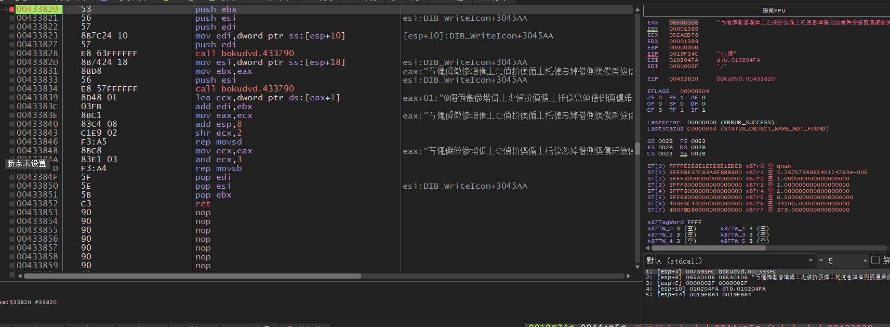
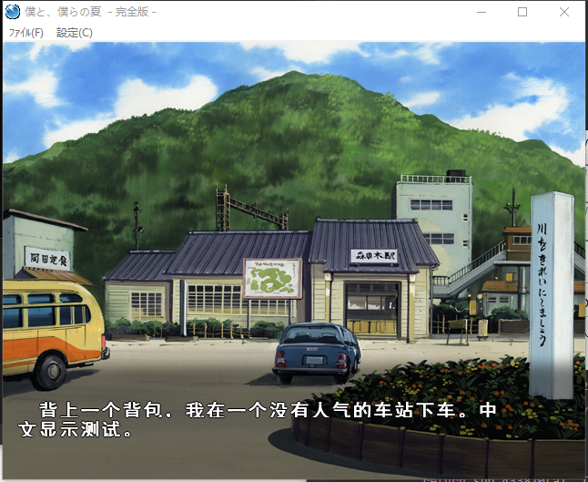

# Malie old version

嘛，自己说的话得自己做到底啊。

不过我做完程序翻译能翻完吗w。

嘛，其实逆了两三天，然后摆烂了，现在看起来，再不写点啥真的要忘了。这作程序还是比较典型的（虽然和后期malie引擎差距很大，完全是重写了整个VM）。

游戏：僕と、僕らの夏完全版


## 一、脚本提取

脚本分的是段的，不过我们不用分析，可以直接dump最后一个区段。

先看下最后区段的内容


嗯，脚本前调用FrameLayer_SendMessage函数来显示字符。但实际上并不是一个字符串对应一个函数，一个函数内可以有多个字符串。所以要根据字符串的特点来提取。

仔细观察，normal字符串都有“/”的标志作为起始，人名则是以“+”开始：


但光判断这个字符肯定会混进来其他东西，所以我们需要过滤掉（即判断第二位是不是sjis范围内）。

还有选项，他的标志是0x09162210，具体怎样追的我就不细说了，有兴趣的可以自己找找看。

这下文本基本结束了，脚本部分我们几乎黑盒分析，事实上，这个脚本是个非常合适黑盒分析训练的练手作，建议可以自己逆一下，说不定还能发现比我更多更准确的内容。

```c++
	for (int i = 0; i < size; i++)
	{
		switch (buff[i])
		{
		case 0x2B:
			Name =(CHAR*)( buff + i + 1 );
			if ((Name[0] & 0xFF) >= 0x81 && (Name[0] & 0xFF) <= 0x9F)
			{
				nm = string(Name);
				output_nm = FixStringA(nm);
				fprintf(fp, "[Name|0x%08x]:%s\r\n;[Name|0x%08x]:%s\r\n\r\n", i + 1, output_nm.c_str(), i + 1, output_nm.c_str());
			}
			break;
		case 0x2F:
			Text = (CHAR*)(buff + i + 1);
			txt = string(Text);
			output_txt = FixStringA(txt);
			fprintf(fp, "[Text|0x%08x]:%s\r\n;[Text|0x%08x]:%s\r\n\r\n", i + 1, output_txt.c_str(), i + 1, output_txt.c_str());
			break;
		default:
			break;
		}
		if (*(int*)(buff + i) == 0x09162210)
		{
			Select = (CHAR*)(buff + i + 4);
			sel = string(Select);
			output_sel = FixStringA(sel);
			fprintf(fp, "[Select|0x%08x]:%s\r\n;[Select|0x%08x]:%s\r\n\r\n", i + 4, output_sel.c_str(), i + 4, output_sel.c_str());
		}

	}
```


## 二、patch制作

翻好的文本肯定要塞回去，这里采用hook 的办法。

我们还是先用CE搜一下ScriptObject所在的地方，一般搜索脚本的EIP（距离vm头到当前指令的offset）。

搜到内存后下断点，然后程序停在这里：

```assembly
0042BC20 | 8B4424 04                | mov eax,dword ptr ss:[esp+4]            |
0042BC24 | 56                       | push esi                                |
0042BC25 | 57                       | push edi                                | 
0042BC26 | 8B88 2C000400            | mov ecx,dword ptr ds:[eax+4002C]        | 
0042BC2C | 8B50 08                  | mov edx,dword ptr ds:[eax+8]            | 
0042BC2F | 8B70 14                  | mov esi,dword ptr ds:[eax+14]           | cur
0042BC32 | 41                       | inc ecx                                 | 
0042BC33 | 8988 2C000400            | mov dword ptr ds:[eax+4002C],ecx        | 
0042BC39 | 8B7A 0C                  | mov edi,dword ptr ds:[edx+C]            | base
0042BC3C | 2BF7                     | sub esi,edi                             | VM_EIP
0042BC3E | 5F                       | pop edi                                 | 
0042BC3F | 89B0 30000400            | mov dword ptr ds:[eax+40030],esi        | 
0042BC45 | 8B80 28000400            | mov eax,dword ptr ds:[eax+40028]        |
0042BC4B | 5E                       | pop esi                                 | 
0042BC4C | 3B48 14                  | cmp ecx,dword ptr ds:[eax+14]           | 
0042BC4F | 7E 03                    | jle bokudvd.42BC54                      |
0042BC51 | 8948 14                  | mov dword ptr ds:[eax+14],ecx           | 
0042BC54 | C3                       | ret                                     |
```

注意我标记的地方，第一个cur是当前脚本位置，base则是脚本起始地点，后面sub esi, edi则是做减法，得到offset。

现在简单了，我们只需要offset直接替换文本就行了。

但是你会发现，在这个函数里面，得到了offset就算换自己的文本与base的offset他只会显示原文。

可能有聪明的人发现，mov esi,dword ptr ds:[eax+14]  这里传入脚本当前的位置，那么直接替换掉[eax+14] 不就行了。

最开始我也是这么想的，然而最后发现，游戏会卡死在当前句，既不会显示，也不会报错。

那么我没只能从文本处理的地方下手了。

用CE搜索文本，下断，跑起来，停在一个获取字符串长度的函数内，往外跟一层，来到这里：



有点复杂，看IDA：


这里就是复制VM里面的字符串到一个位置上。

到这里我们明白了，可以修改这个函数，copy我们自己的文本到a1去。

事不宜迟，直接开干：

```C++
DWORD off = 0;
CHAR* TestText = (CHAR*)"　背上一个背包，我在一个没有人气的车站下车。中文显示测试。";
int (__cdecl *sub_42BC20)(DWORD* a1);
int __cdecl UpdareEIP(DWORD* a1)
{
    int v1; // edx
    int v2; // esi
    int v3; // ecx
    int result; // eax

    v1 = a1[2];
    v2 = a1[5];
    v3 = a1[0x1000B] + 1;
    a1[0x1000B] = v3;
    a1[0x1000C] = v2 - *(DWORD*)(v1 + 0xC);
    off = a1[0x1000C];
    result = a1[65546];
    if (v3 > *(DWORD*)(result + 0x14))
        *(DWORD*)(result + 0x14) = v3;
    return result;
}
unsigned int(__cdecl* sub_433820)(CHAR* a1, CHAR* a2);
unsigned int __cdecl RefStrCopy(CHAR* a1, CHAR* a2)
{
    if (off == 0x0053d0e5)
        return sub_433820(a1, TestText);
    return sub_433820(a1, a2);
}
```



至此，分析完毕。